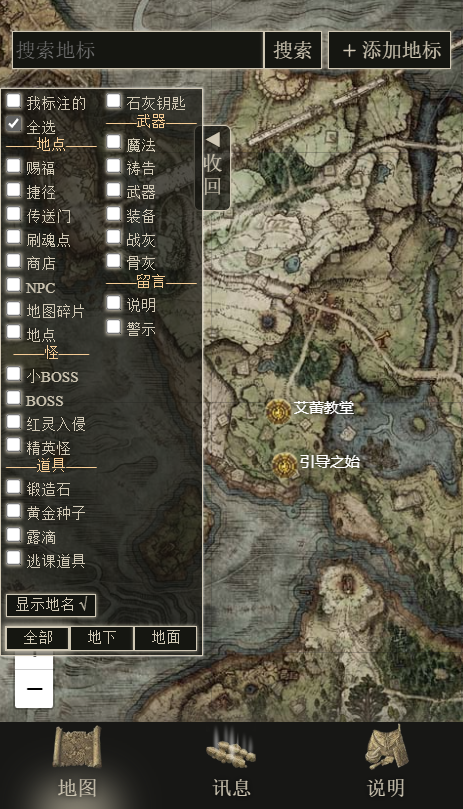
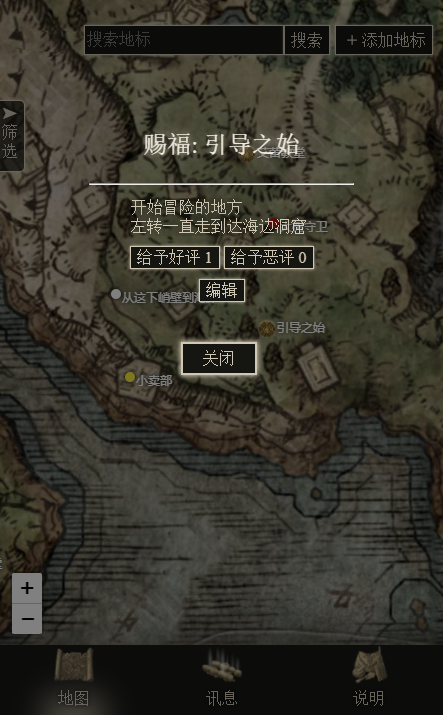

<p align="center" style="font-size: 2em; font-weight: bold;">
   
</p>
<div align="center">
 
# 老头环协作编辑地图
 
### 𝐄𝐋𝐃𝐄𝐍 𝐑𝐈𝐍𝐆 𝐎𝐍𝐋𝐈𝐍𝐄 𝐌𝐀𝐏
   


   
 
地址：https://www.elpwc.com/eldenringmap/
</div>


<hr/>

## 技术栈

- Frontend: Svelte + Leaflet, via TypeScript
- Backend: PHP + MySQL, based on Apache + nginx, WinServer

一开始只是随手写的个人用的小网站，因为一直有在尝鲜 Svelte 框架，就很大胆地使用了  
选用纯 PHP 写后端接口也是图方便省事的原因

地图是基于 Leaflet 实现的，现行版本的地标全部使用 DOM 渲染。

## 截图




## 关于参与开发

老头环地图的日访问量一直维持在20-30万之间，在如此庞大的用户量面前，我笨拙的技术水平已经不足以跟得上日日增加的计划功能、反馈的bug的开发，所以，欢迎通过邮件/QQ/issue联系 参与到开发里来~

## 贡献者

| ||
|-|-|
|spking11([@spking11](https://github.com/spking11))|Ranger([@RangerChen](https://github.com/RangerChen))|


## 部署

之前被问了如何部署，就姑且随意写一下

1. git 到本地后，先

   ```
   npm i
   ```

   (废话)

2. 后端的话，确保有 php 的运行环境就可以了
3. 数据库建立参考 `/database.sql`
4. 数据库配置在 `/public/api/private/` 里  
   里面有

   - dbcfg.example.php
   - illegal_words_list.example.php
   - admin.example.php

   三个文件  
   分别是 **数据库配置**，**屏蔽词列表**，**Admin 模式密码**  
   根据里面的内容增添一下，再把文件名里的 `.example` 去掉就可以正常使用了  
   在前端进入管理员模式的办法可以可以细读 `src/pages/About.svelte` 内容，进入了就可以直接在前端对各个数据删改了(说明页会出现一个（Admin）字样说明已进入 Admin 模式

5. 项目使用的 svelte 框架算是多少有些非主流的框架，结构上类似于 Vue，可以参考 [Svelte 官网](https://svelte.dev/) / [Svelte 中文网](https://www.sveltejs.cn/)
6. 前端使用
   ```
   npm run build
   ```
   编译后，/public 内就是可以直接扔进服务器跑的东西了
7. 关于各个文件的说明在 /src/description.txt

   完成

## 开源许可

MIT

在包含此协议的前提下可以随意使用、修改、发布 EldenRingMap 的代码。

